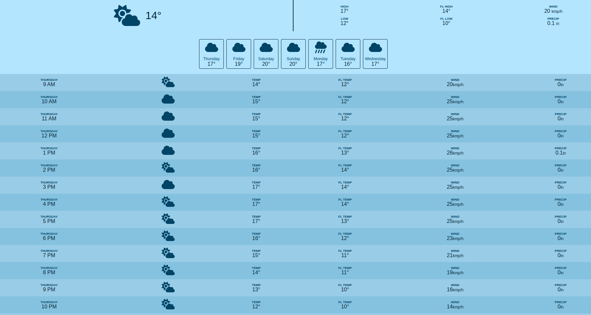

# Plain Javascript weather app 

- Weather app that fetches weather data using open Meteo's api https://open-meteo.com/

- Data then presented using the good ol javascript, html and css, no frameworks used

- View the site live [Weather app live link](https://shasa-plainjs-weather-app.netlify.app/)

## Screenshot 

